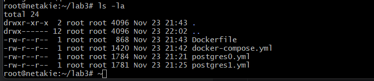
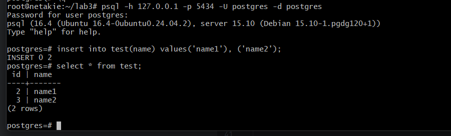

# ЛР 3. HA Postgres Cluster

## Часть 1. Поднимаем Postgres

Создал файлы конфигурации:

1. [Dockerfile](./Dockerfile)
2. [docker-compose.yml](./docker-compose.yml)
3. [postgres0.yml](./postgres0.yml)
4. [postgres1.yml](./postgres1.yml)



Задеплоил командой:

```bash
docker-compose up -d
```

Проверил логи, pg-slave - мастер нода:
```bash
docker logs pg-master
docker logs pg-slave
docker logs zoo
```


## Часть 2. Проверяем репликацию

Подключение к postgres0:
```bash
psql -h 127.0.0.1 -p 5433 -U postgres -d postgres
```

Подключение к postgres1:
```bash
psql -h 127.0.0.1 -p 5434 -U postgres -d postgres
```

Создал таблицу и добавил в неё несколько записей на мастер ноде:



Просмотрел содержимое таблицы и попробовал её изменить на слейв ноде:


## Часть 3. Делаем высокую доступность

Добавил конфигурацию HAProxy: [haproxy.cfg](./haproxy.cfg)

Обновил файл [docker-compose.yml](./docker-compose.yml) и перезапустил проект, pg-slave снова стала мастер нодой:

pg-master:

pg-slave:

zoo:

haproxy:


Подключился к бд через HAProxy, произошел редирект на pg-slave:


## Задание

### Описание задания

Любым способом выключаем доступ до ноды, которая сейчас является мастером (например, через docker stop). Некоторое время ждем, после этого анализируем логи и так же пытаемся считать/записать что-то в БД через entrypoint подключение. Затем необходимо расписать, получилось или нет, а так же объяснить, что в итоге произошло после принудительного выключения мастера (со скриншотами)

### Выполнение задания

Отключил мастер ноду pg-slave:

```bash
docker stop pg-slave
```

pg-master:


haproxy:


Подключение через HAProxy:


При отключениии мастер ноды HAProxy сделал новым мастером слейв ноду, то есть отключил read-only режим для неё.

## Ответы на вопросы

1. *Порты 8008 и 5432 вынесены в разные директивы, expose и ports. По сути, если записать 8008 в ports, то он тоже станет exposed. В чем разница?*

> EXPOSE порты не публикуются на хосте, они будут доступны только связанным службам Docker-Compose, а порты прописанные в `ports` будут открыты на хост-машине.

2. *При обычном перезапуске композ-проекта, будет ли сбилден заново образ? А если предварительно отредактировать файлы postgresX.yml? А если содержимое самого Dockerfile? Почему?*

> Eсли изменить содержимое Dockerfile образ будет сбилден заново, потому что Docker-Compose отслеживает изменения в Dockerfile. При обычном перезапуске проекта пересборки образа не будет, потому что Docker-Compose использует существующий образ, если он есть. При изменении конфигов postgresX.yml пересборки образа не будет, потому что они монтированы как тома, то есть эти файлы копируются в ранее созданный образ.